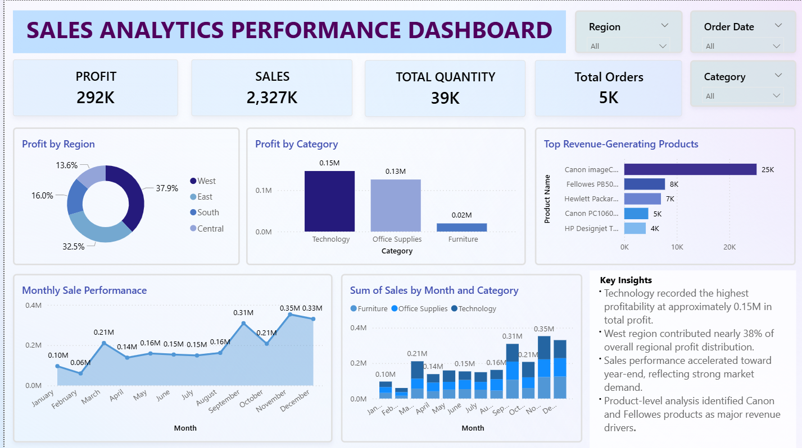

# Business Sales Performance Analytics Dashboard

## Project Overview
This Power BI dashboard analyzes sales performance, profitability, regional trends, and top-performing products.

## Tools Used
- Power BI
- Power Query
- DAX
- Excel

## Key Metrics
- Total Sales: 2.327M
- Total Profit: 292K
- Total Quantity: 39K
- Total Orders: 5K

## Dashboard Features
- Sales & Profit KPIs
- Regional Profit Analysis
- Category-wise Profit Analysis
- Top Revenue Products
- Monthly Sales Trends

## Dashboard Preview

## Key Insights
- Technology generated the highest profit.
- West region contributed the highest profit share.
- Sales increased significantly in the last quarter.
- Canon products generated the highest revenue.
